 

<table align="center">
<tr>
<td width="55%" valign="top">

### 👋 About Me

- 🔭 Currently building source code projects like **[E-Stream](https://github.com/Omegatech-01/E-Stream)** and more
- 🌱 Always learning new tools in the JS/TS ecosystem
- 💬 Ask me about React, Vite, Tailwind, and Node
- ⚡ Fun fact: this whole README updates itself

 

</td>
<td width="45%" align="center">

</td>
</tr>
</table>

---

## 📊 GitHub Stats

---

## 🏆 Trophies

---

## 🛠️ Tech Stack

---

## 🐍 Contribution Snake

> ⚙️ The snake graph above needs a one-time setup — see the note below.

---

## 📫 Connect With Me

